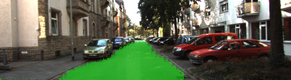

# Semantic Segmentation using a fully-convolutional neural netwok (FCN)

## Network architecture

This network utilizes pre-trained layers from VGG and custom-built deconvolutional layers with skipped connections as can be seen in the image below:

## Network output

Network labels road surface pixels:

